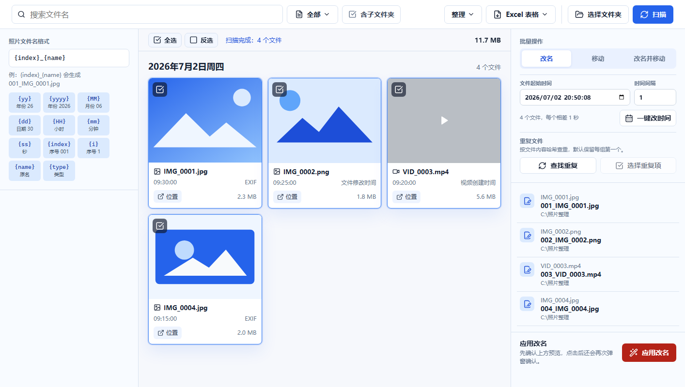

# 文件整理

**中文** | [English](README_EN.md)

文件整理是一个本地文件整理软件。它可以读取图片、视频和普通文件的时间信息，按时间浏览文件，并批量完成改名、移动、表格改名、修改文件时间、查找重复文件等操作。

它不只适合相册，也可以整理普通文件夹。文件夹里只有图片和视频时，软件会用缩略图预览；如果包含普通文件或混合文件，软件会自动切换成列表显示。

## 适合这些场景

- 手机、相机、微信导出的照片和视频名称混乱。
- 想把文件改成 `001_IMG_0001.jpg` 这类统一格式。
- 想按日期生成文件夹，比如 `260702_IMG_0001`。
- 想把文件移动到指定文件夹，同时保留或改名。
- 想用 Excel 手动填写新文件名和新后缀，再批量执行。
- 想统一修改一批文件的创建时间、修改时间和访问时间。
- 想找出重复文件，再选择要处理的重复项。

## 界面预览



左侧设置文件名和文件夹格式，中间浏览文件，右侧预览和执行批量操作。

## 主要功能

- **扫描文件夹**：选择本地文件夹后读取文件列表，可选择是否包含子文件夹。
- **按时间浏览**：优先读取图片 EXIF 时间和视频创建时间，缺失时使用文件修改时间。
- **搜索和筛选**：按文件名搜索，也可以筛选全部、图片、视频或文件。
- **批量改名**：使用模板生成新文件名，执行前会在右侧显示预览。
- **批量移动**：选择目标文件夹后，把选中文件移动过去。
- **改名并移动**：一次完成新文件名和目标文件夹归档。
- **Excel 表格改名**：导出文件清单，编辑新文件名和新后缀，再导入执行。
- **修改文件时间**：设置文件起始时间和时间间隔，一键修改创建、修改和访问时间。
- **查找重复文件**：按大小和 SHA-256 哈希查找重复项。
- **操作历史**：记录已执行的改名和移动操作，可撤销。

## 使用方法

1. 点击顶部 **选择文件夹**，选择要整理的本地文件夹。
2. 按需要勾选或取消 **包含子文件夹**。
3. 点击 **扫描**，软件会读取文件时间并生成预览。
4. 用顶部搜索框或类型筛选缩小文件范围。
5. 用 **全选** 或 **反选** 选择要处理的文件。
6. 在右侧选择批量操作：**改名**、**移动** 或 **改名并移动**。
7. 如果要移动文件，先在右侧选择目标文件夹。
8. 检查右侧预览，确认无误后点击执行按钮。

## 批量改名

默认文件名格式：

```text
{index}_{name}
```

示例：

```text
IMG_0001.jpg -> 001_IMG_0001.jpg
IMG_0002.png -> 002_IMG_0002.png
```

常用令牌：

| 令牌 | 含义 | 示例 |
|---|---|---|
| `{yyyy}` | 四位年份 | `2026` |
| `{yy}` | 两位年份 | `26` |
| `{MM}` | 月份 | `07` |
| `{dd}` | 日期 | `02` |
| `{HH}` | 小时 | `09` |
| `{mm}` | 分钟 | `30` |
| `{ss}` | 秒 | `05` |
| `{index}` | 三位序号 | `001` |
| `{i}` | 普通序号 | `1` |
| `{name}` | 原文件名，不含后缀 | `IMG_0001` |
| `{type}` | 文件类型 | `image` |

## 移动到指定文件夹

移动文件时可以只选择目标文件夹，也可以设置文件夹格式。

默认文件夹格式：

```text
{yy}{MM}{dd}_{name}
```

示例：

```text
IMG_0001.jpg -> 260702_IMG_0001\IMG_0001.jpg
```

选择 **改名并移动** 时，软件会先按文件名格式生成新文件名，再按文件夹格式移动到目标位置。

## Excel 表格改名

1. 先扫描文件并选中要处理的文件。
2. 点击顶部 **Excel 表格**，选择 **导出表格**。
3. 在表格里编辑 **新文件名** 和 **新后缀**。
4. 回到软件，点击 **Excel 表格**，选择 **导入表格**。
5. 右侧会显示表格改名预览，确认后点击 **运行表格改名**。

`新后缀` 可以填写 `jpg`、`.jpg`、`png`、`.pdf` 这类格式。没有填写新后缀时，软件会保留原后缀。

## 修改文件时间

右侧可以设置 **文件起始时间** 和 **时间间隔**。执行后，软件会按当前文件顺序依次修改每个文件的创建时间、修改时间和访问时间。

示例：起始时间为 `2026-07-02 09:30:00`，时间间隔为 `1` 秒，4 个文件会依次变成：

```text
09:30:00
09:30:01
09:30:02
09:30:03
```

## 更新日志

查看 [CHANGELOG.md](CHANGELOG.md)。

## 下载和运行

Windows 用户可以从 GitHub Release 下载 exe 文件后直接运行。

如果从源码运行：

```bash
pnpm install
pnpm run dev
```

如果要重新打包桌面软件：

```bash
pnpm run build:desktop
```
